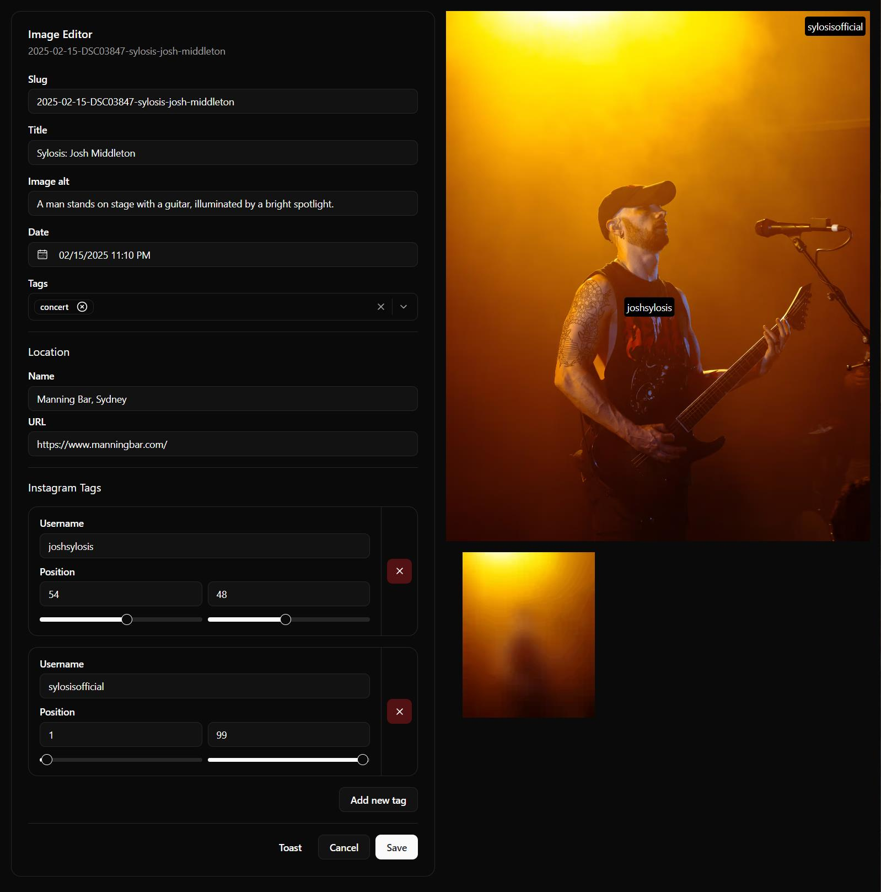

<a name="readme-top"></a>

<br />
<div align="center">
  

  <h3 align="center">Photo Markdown editor</h3>
  <p align="center">
    Bespoke photo markdown editor built to make editing image post metadata easier
    <br />
  </p>
</div>

## Why?

I don't really want to be hosting my images on a CMS (at the moment), these images live directly in my portfolio repository as `.avif` files, with a matching `.md` file. These become cumbersome to edit, especially as I added more front matter fields.

This quickly thrown together tool has been configured as a Turborepo package, with both a backend and a frontend.

If you wish to run this yourself, you can easily swap out the backend or frontend implementation. Or manually edit the backend `server.ts` file to map to your specific front matter fields.

## Tech Stack

### Backend

- [Hono](https://hono.dev/)
- [sharp](https://sharp.pixelplumbing.com/)
- [exifr](https://github.com/MikeKovarik/exifr)

### Frontend

- [Tanstack Start](https://tanstack.com/start/)
- [shadcn/ui](https://ui.shadcn.com/)
- [TailwindCSS](https://tailwindcss.com/)
- other various `shadcn/ui` type inputs

### Shared (Backend & Frontend)
- [TurboRepo](https://turborepo.com/)
- [TypeScript](https://www.typescriptlang.org/)
- [zod](https://zod.dev/)

## Screenshot



## Example Front Matter

```md
---
title: "Sylosis: Josh Middleton"
date: 2025-02-15T12:10:53.000Z
tags: [concert]
src: "./2025-02-15-DSC03847-sylosis-josh-middleton.avif"
alt: image
metadata:
  make: SONY
  model: DSC-RX100M7
  lens: 24-200mm F2.8-4.5
  fStop: 4.5
  shutterSpeed: 0.0125
  iso: 200
  focalLength: 145
location: 
  name: Manning Bar, Sydney
  url: 'https://www.manningbar.com/'
links:
  - url: 'https://www.instagram.com/sylosisofficial/'
    type: 'instagram'
instagramTags:
  - username: 'joshsylosis'
    position: [54, 48]
  - username: 'sylosisofficial'
    position: [1, 99]
blurHash: "data:image/avif;base64,AAAAHGZ0-EXAMPLE_BLUR_HASH"
---

Extra **markdown content**, that can be *formatted* as you `normally` would format in [markdown](https://lukesecomb.digital).
```

## Installation

```shell
pnpm install
pnpm dev
```

`pnpm dev` will run both the server and the frontend.


## Roadmap

Probably not much. I'd love to build out a drag and drop "upload" type page when I find some time to do so. I already have the bulk of the "upload" logic living in my portfolio repo. This currently reads `.jpg`s exported from Lightroom/Darktable, reads their EXIF data, generates a `.md` file and uses `sharp` to convert the image to `.avif` (as well as apply some optimisation for web). This also auto generates a small `blurHash` to act as a placeholder while the main images is loading on the site.

Feel free to fork this repo and tweak as required. I don't plan on building this out as a "proper project", but more a space that may change without notice as my needs change.